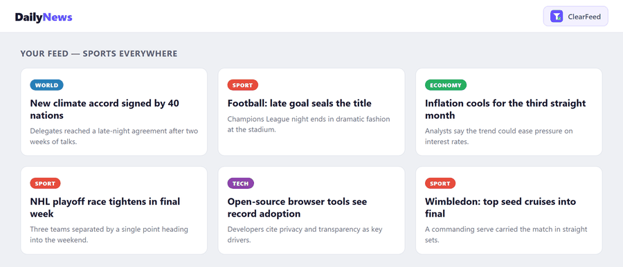
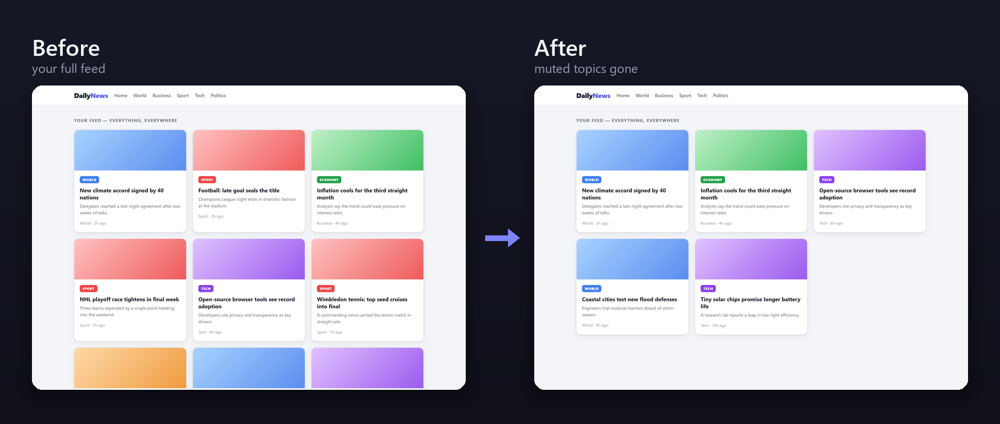
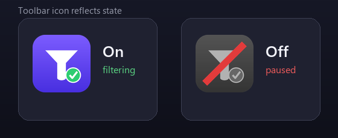

# ClearFeed

[](https://github.com/Martin8O/ClearFeed/actions/workflows/ci.yml)
[](LICENSE)
[](SECURITY.md#automated-safety-checks)
[](PRIVACY.md)

**Clean your feed. Focus on what matters to you.** ClearFeed is a lightweight Chrome extension (Manifest V3) that quietly mutes the topics you'd rather not see — politics, gossip, spoilers, sports, or **any keywords you choose** — across news sites and feeds. You stay in control: nothing is muted unless you ask for it.



**Before / after** — with *Sports* and *Politics* muted, those articles are hidden automatically as you browse:



## Features

- **Pick your topics.** Start from one-click **suggested topics** (Politics, Celebrity gossip, Crime & disasters, Money & crypto, Spoilers, Sports) or add your own — each comes with a ready-made keyword list.
- **Fully editable.** Every topic is just an editable keyword list. A word *stem* is enough: `elect` catches *election*, *elections*, *electoral*…
- **Multi-language.** Switch the app language and seeded word lists across **16 languages** (English, Español, Deutsch, Français, Čeština, Polski, Italiano, Português, Nederlands, Русский, Українська, Türkçe, Svenska, Dansk, Norsk, Suomi) — so filtering works on your local news too.
- **Per-topic on/off** toggles, plus a master switch to pause everything.
- **Keyboard shortcut** (`Ctrl+Shift+F`, `⌘+Shift+F` on Mac) toggles filtering on/off without opening the popup — rebind it any time from the About panel. The toolbar icon greys out with a red slash while paused, so the state is always visible:

  
- **Excluded sites.** Add domains (banking, e-mail, …) where filtering should never run — one click excludes the site you're on.
- **Reveal hidden items** — one click temporarily shows what was hidden on the page (outlined), then re-hides it, so nothing happens behind your back.
- **Settings backup** — export your topics and excluded sites to a JSON file and import them on another machine.
- **Counter** of how much noise it has filtered out, and **word-boundary matching** so short words won't match inside unrelated words.

## How it works

On first run nothing is filtered — you choose topics from the popup. A content script then scans article-like elements on each page and hides any whose text matches an enabled topic's words. Dynamic content (infinite scroll, AJAX feeds) is handled with a debounced `MutationObserver`. Settings live in `chrome.storage.local`.

## Privacy & safety

ClearFeed is **private by design** — and the claims are machine-checked, not just promised:

- 🔒 **Zero network requests.** No `fetch`, `XMLHttpRequest`, `WebSocket`, or beacons anywhere in the code. Nothing you read can leave your device.
- 🚫 **No tracking, analytics, or accounts.** There is nothing to collect and no one to send it to.
- 💾 **Local-only storage.** Your categories and settings live in `chrome.storage.local` and never sync or upload.
- 🧩 **No remote code.** No `eval`, no `new Function`, no externally loaded scripts.
- 🔍 **Auditable, no build step.** The files in this repo are exactly what Chrome runs — nothing is minified or hidden.
- ✅ **Proven on every commit.** A [static safety audit](test/safety.test.mjs) fails CI if any of the above is ever violated.

Full details: [PRIVACY.md](PRIVACY.md) · [SECURITY.md](SECURITY.md)

## Tests

No build step and zero dependencies — tests use Node's built-in runner:

```bash
node --test
```

This runs the **safety audit** (`test/safety.test.mjs`, scans shipped code for unsafe patterns) and **logic tests** (`test/logic.test.mjs`, exercises word-boundary matching, domain handling, and HTML escaping). Both run automatically via GitHub Actions.

## Install (unpacked)

1. Open `chrome://extensions`.
2. Enable **Developer mode** (top-right).
3. Click **Load unpacked** and select this folder.
4. Pin the ClearFeed icon and open the popup to pick your topics.

## Files

| File | Purpose |
|------|---------|
| `manifest.json` | Extension manifest (MV3) |
| `content.js` | Scans pages and hides matching articles |
| `background.js` | Service worker — keyboard-shortcut toggle and toolbar-icon state |
| `presets.js` | Suggested topics + seeded word lists per language |
| `i18n.js` | UI strings for the in-app language switcher |
| `popup.html` / `popup.js` | Settings UI (topics, excluded sites, counter) |
| `icon16/48/128.png` | Toolbar / store icons (`-off` variants shown while paused) |
